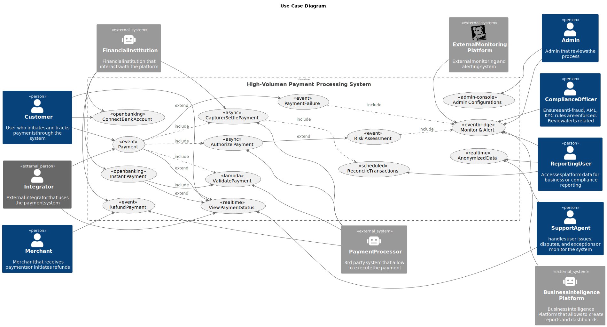

# 1 Introduction and Goals

<!-- TOC -->

- [1 Introduction and Goals](#1-introduction-and-goals)
    - [1.1 Requirements Overview](#11-requirements-overview)
    - [1.2 Quality Goals](#12-quality-goals)
    - [1.3 Systems Stakeholders](#13-systems-stakeholders)
- [Solution Content](#solution-content)

<!-- /TOC -->

The High Volume Payment processing platform (HVP3) is a system designed to handle high transaction volumes while ensuring security, scalability, and compliance with industry standards. 

The architecture leverages microservices, cloud-native technologies, and robust security measures to achieve these goals.

As per this is designed for a Fintech company, it is needed to consider the customer need of an instant and seamless financial transaction in multiple currencies and payment methods. The system should be able to handle high transaction volumes, provide real-time processing, and ensure security and compliance with industry regulations.

This financial regulations include PCI DSS, GDPR, and other relevant standards. The system should also be designed to be scalable, flexible, and maintainable to accommodate future growth and changes in the financial landscape.

For integration with other financial institutions, the system should support various APIs and protocols to facilitate seamless communication and data exchange.

## 1.1 Requirements Overview

| ID   | Use Case (Functional Requirement) | Description |
|------|-----------------------------------|-------------|
| UC-001 | Payment                           | Initiate a payment from customer or integrator and process it through validation, authorization, and settlement. |
| UC-002 | Validate Payment                  | Validate the payment against business rules, customer identity, balance, and compliance policies. |
| UC-003 | Authorize Payment                 | Request authorization from a payment processor to approve the transaction. |
| UC-004 | Capture/Settle Payment            | Capture authorized payments and settle them with financial institutions or processors. |
| UC-005 | Refund Payment                    | Process full or partial refunds back to the customer via the original payment route. |
| UC-006 | View Payment Status               | Allow users/systems to view or receive real-time updates about the status of their payments. |
| UC-007 | Payment Failure                   | Handle timeouts, technical issues, and declined payments through retry logic and failure tracking. |
| UC-008 | Monitor & Alert                   | Detect errors, anomalies, or suspicious activity using event-driven monitoring and alerting. |
| UC-009 | Reconcile Transactions            | Reconcile transactions with external financial institutions to ensure consistency and correctness. |
| UC-010 | Admin Configurations              | Manage dynamic platform settings such as limits, roles, fees, and access controls. |
| UC-011 | Connect Bank Account              | Allow customers to connect their bank accounts using Open Banking protocols. |
| UC-012 | Instant Payment                   | Enable direct bank-to-bank payments using PISP (Payment Initiation Service Provider) mechanisms. |
| UC-013 | Risk Assessment                   | Analyze risk score of a transaction based on internal and external data sources. Also Evaluate AML, KYC, and other risk factor assessments |
| UC-014 | Anonymized Data                   | Generate anonymized datasets for reporting or ML analysis. |

## 1.2 Quality Goals

Based on [ISO 25010](https://www.iso.org/es/contents/data/standard/07/81/78176.html) we have defined the following quality goals for the project:

| ID | Quality | Motivation |
|---|---|---|
| QG-001 | Security | Implement robust security measures to protect sensitive financial data and ensure compliance with industry regulations: - GDPR - PSD2  - Anti Money Laundering   |
| QG-002 | Security | Main Principles for security includes E2E Encryption, Zero Trust and Least Privilege, strong multifactor authentication and multiple modular controls. |
| QG-003 | Compatibility | System should be able to exchange information with other financial institutions |
| QG-004 | Compatibility | System should be able to exchange information with third party payment gateways |
| QG-005 | Maintainability | Implement comprehensive monitoring and logging to track performance and detect issues. |
| QG-006 | Transferability | System should be able to run in any of the Jenkins instances |
| QG-007 | Performance Efficiency | The platform should be able to scale horizontally to handle increasing transaction volumes. |
| QG-008 | Performance Efficiency | Optimize for low latency and high throughput to provide a smooth user experience. |
| QG-009 | Reliability | Ensure the platform is highly available with minimal downtime. |
| QG-010 | Reliability | Ensure the system can recover quickly from failures and maintain data consistency. |
| QG-011 | Usability | Ensure the platform is user-friendly and easy to navigate for both end-users and administrators. |

## 1.3 Systems Stakeholders

| Stakeholder           | Description                                           | Goal/Intention |
|-----------------------|-------------------------------------------------------|----------------|
| Customer              | End-user who initiates and tracks payments.           | - Make secure and fast payments - View transaction status - Request refunds |
| Merchant              | Business that receives payments or initiates refunds. | - Receive customer payments - Issue refunds - Monitor settlement |
| Integrator            | External system integrating with the platform APIs.   | - Initiate and track payments via APIs - Access payment status - Integrate Open Banking flows |
| Financial Institution | Bank or Open Banking provider interacting with the platform. | - Approve and settle transactions - Provide account and payment data via APIs |
| Compliance Officer    | User who reviews and ensures adherence to regulations. | - Monitor alerts - Review KYC/AML data - Ensure platform compliance |
| Support Agent         | Resolves issues and monitors payment workflows.       | - Handle disputes - Support end-users - Monitor failed transactions |
| Admin                 | Manages platform rules, access, and system parameters. | - Configure fees, limits, and roles - Review platform health and alerts |
| Reporting User        | Accesses system data for analytics or compliance.     | - Generate reports - Review historical transactions - Monitor KPIs |
| Payment Processor     | Third-party system to execute payment instructions.   | - Authorize and settle payments - Relay payment status back to platform |
| Business Intelligence Platform | Internal or external tool for dashboard and data insights. | - Consume anonymized data - Provide analytics - Enable business decision-making |
| External Monitoring System | External system for monitoring and alerting. | - Monitor system health - Trigger alerts based on predefined rules - Provide insights into system performance |

<!-- CONTENTTABLE:START -->
# Solution Content

1. [Introduction and Goals](01-introduction-and-goals.md)
2. [Technical Constraints](02-technical-constraints.md)
3. [System Context and Scope](03-system-context-and-scope.md)
4. [Building Block View](04-building-block-view.md)
5. [Runtime Overview](05-RuntimeOverview.md)
6. [Design Decisions](06-design-decisions.md)
7. [Technical Risks](07-technical-risks.md)
8. [Quality Requirements](08-quality.md)
9. [Glossary](09-glossary.md)
<!-- CONTENTTABLE:END -->
