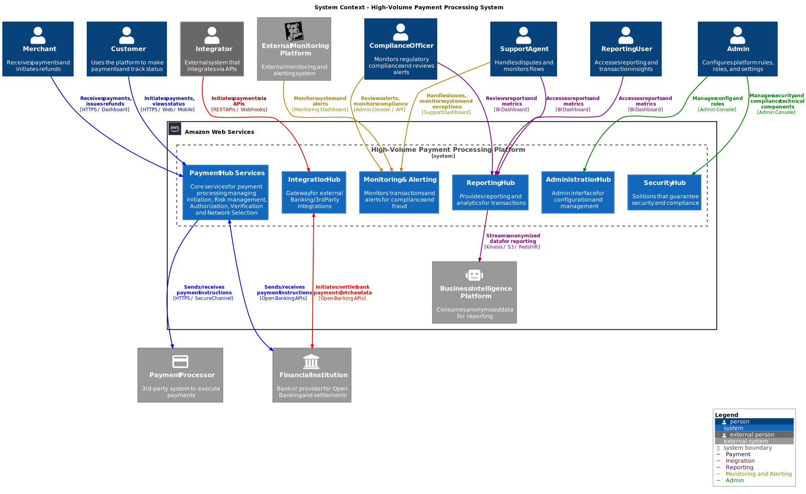
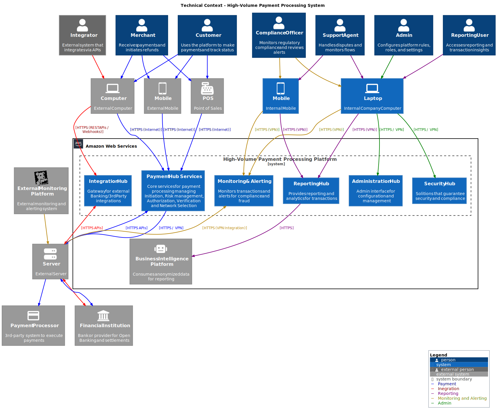

# 3 System Context and Scope

<!-- TOC -->

- [3 System Context and Scope](#3-system-context-and-scope)
    - [3.1 System Context Diagram](#31-system-context-diagram)
        - [3.1.1 Interaction Details](#311-interaction-details)
- [Solution Content](#solution-content)

<!-- /TOC -->

This architecture follow the patterns of [C4 Model](https://c4model.com/) and the [4+1 Architectural View Model](https://en.wikipedia.org/wiki/4%2B1_architectural_view_model)

This section contain all the delimits of the systems and communications. The specific nodes and components will be defined in the next sections.

## 3.1 System Context Diagram

| Neighbor              | Description                                                                                       | Channel/Interface                                                                                       |
|------------------------|---------------------------------------------------------------------------------------------------|---------------------------------------------------------------------------------------------------------|
| Customer               | Uses the platform to make payments and track their status. Interacts with the Payment Hub Services via HTTPS/Web/Mobile. | **Channel:** HTTPS (Internet)   **Interface:** Web/Mobile applications connecting to Payment Hub Services |
| Merchant               | Receives payments and initiates refunds. Interacts with the Payment Hub Services via HTTPS/Dashboard. | **Channel:** HTTPS (Internet)   **Interface:** Web/Dashboard applications connecting to Payment Hub Services |
| Integrator             | External system that integrates with the platform via APIs to initiate payments. Interacts with the Integration Hub via REST APIs/Webhooks. | **Channel:** HTTPS (REST APIs/Webhooks)   **Interface:** REST APIs/Webhooks connecting to Integration Hub |
| Compliance Officer     | Monitors regulatory compliance and reviews alerts. Interacts with the Monitoring & Alerting system and Reporting Hub via Admin Console/API. | **Channel:** HTTPS (VPN)   **Interface:** Admin Console/API connecting to Monitoring & Alerting and Reporting Hub |
| Support Agent          | Handles disputes and monitors payment workflows. Interacts with the Monitoring & Alerting system and Reporting Hub via Support Dashboard. | **Channel:** HTTPS (VPN)   **Interface:** Support Dashboard connecting to Monitoring & Alerting and Reporting Hub |
| Admin                  | Configures platform rules, roles, and settings. Manages security and compliance technical components. Interacts with the Administration Hub and Security Hub via Admin Console. | **Channel:** HTTPS (VPN)   **Interface:** Admin Console connecting to Administration Hub and Security Hub |
| Reporting User         | Accesses reporting and transaction insights. Interacts with the Reporting Hub via BI Dashboard. | **Channel:** HTTPS (VPN)   **Interface:** BI Dashboard connecting to Reporting Hub |
| Financial Institution  | Bank or provider for Open Banking and settlements. Initiates/settles bank payments and fetches data. Interacts with the Integration Hub and Payment Hub Services via Open Banking APIs. | **Channel:** HTTPS APIs   **Interface:** Open Banking APIs connecting to Integration Hub and Payment Hub Services |
| Payment Processor      | 3rd-party system to execute payments. Sends/receives payment instructions. Interacts with the Payment Hub Services via HTTPS/Secure Channel. | **Channel:** HTTPS (VPN)   **Interface:** Secure Channel connecting to Payment Hub Services |
| Business Intelligence Platform | Consumes anonymized data for reporting. Interacts with the Reporting Hub via Kinesis/S3/Redshift. | **Channel:** HTTPS   **Interface:** Kinesis/S3/Redshift connecting to Reporting Hub |
| External Monitoring System | Monitors system health and performance. Interacts with the Monitoring & Alerting system via APIs. | **Channel:** HTTPS (VPN)   **Interface:** APIs connecting to Monitoring & Alerting system  |

### 3.1.1 Interaction Details

**Customer, Merchant, Integrator**: These actors interact with the Payment Hub Services primarily through HTTPS over the internet, however we can support VPN for high secure customers in case that it is required. Customers and merchants use web, desktop or mobile applications, while integrators use REST APIs and webhooks for integration.

**Compliance Officer, Support Agent, Admin, Reporting User**: These internal users interact with the system through secure VPN channels. They use various dashboards and consoles to access the Monitoring & Alerting system, Reporting Hub, Administration Hub, and Security Hub.

**Financial Institution, Payment Processor**: These external systems interact with the Payment Hub Services and Integration Hub through secure HTTPS APIs and channels. They handle payment instructions, settlements, and data exchange. In general the interaction between the system and the app will happen through Open Banking APIs, but in some cases we can use other channels like secure channels or even direct connections with the different payment processors (P2P, Credit Card, Crypto, etc.).

**Business Intelligence Platform**: This platform consumes anonymized data from the Reporting Hub through secure HTTPS channels, using services like Kinesis, S3, and Redshift for data streaming and storage.

**External Monitoring System**: This system monitors the health and performance of the Payment Hub Services and Integration Hub. It interacts with the Monitoring & Alerting system through secure HTTPS channels, providing insights and alerts based on predefined rules. Also provides logging analytics and performance metrics that enhances the overall monitoring capabilities of the system.

<!-- CONTENTTABLE:START -->
# Solution Content

1. [Introduction and Goals](01-introduction-and-goals.md)
2. [Technical Constraints](02-technical-constraints.md)
3. [System Context and Scope](03-system-context-and-scope.md)
4. [Building Block View](04-building-block-view.md)
5. [Runtime Overview](05-RuntimeOverview.md)
6. [Design Decisions](06-design-decisions.md)
7. [Technical Risks](07-technical-risks.md)
8. [Quality Requirements](08-quality.md)
9. [Glossary](09-glossary.md)
<!-- CONTENTTABLE:END -->
