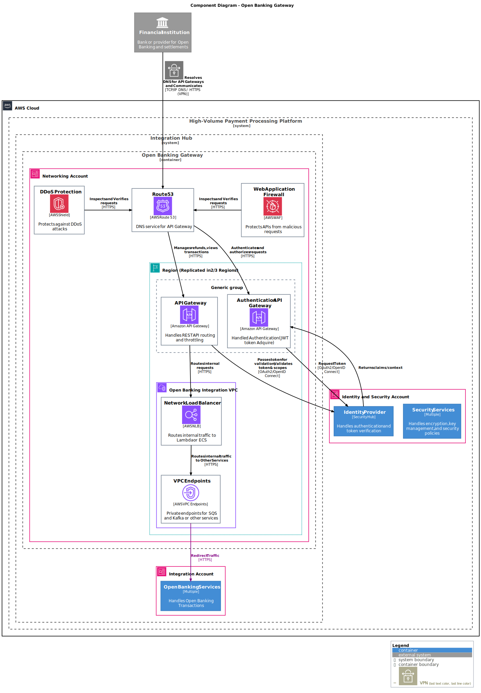
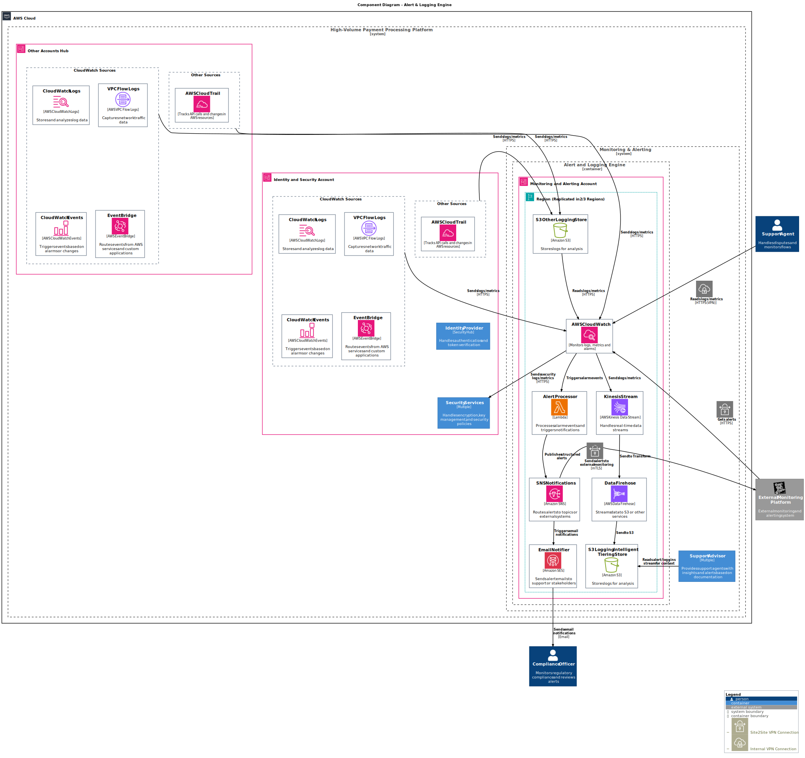

# 4 System Context and Scope

<!-- TOC -->

- [4 System Context and Scope](#4-system-context-and-scope)
    - [4.1 Container Diagram](#41-container-diagram)
    - [4.2 Components Diagrams](#42-components-diagrams)
        - [4.2.1 Payment Hub - Payment API Gateway](#421-payment-hub---payment-api-gateway)
        - [4.2.2 Payment Hub - Payment Orchestrator](#422-payment-hub---payment-orchestrator)
        - [4.2.3 Payment Hub - Payment Ledger & Data Manager](#423-payment-hub---payment-ledger--data-manager)
        - [4.2.4 Payment Hub - Risk Assessment Engine](#424-payment-hub---risk-assessment-engine)
        - [4.2.5 Integration Hub - Open Banking Gateway](#425-integration-hub---open-banking-gateway)
        - [4.2.6 Integration Hub - Open Banking Services](#426-integration-hub---open-banking-services)
        - [4.2.7 Integration Hub - 3rd Party Gateway](#427-integration-hub---3rd-party-gateway)
        - [4.2.8 Monitoring & Logging - Alert Engine](#428-monitoring--logging---alert-engine)
        - [4.2.9 Monitoring & Logging - Support Advisor](#429-monitoring--logging---support-advisor)
        - [4.2.10 Reporting Hub - Analytics Engine](#4210-reporting-hub---analytics-engine)
        - [4.2.11 Administration Hub - Configuration Platform](#4211-administration-hub---configuration-platform)
        - [4.2.12 Security Hub - Security Services](#4212-security-hub---security-services)
        - [4.2.13 Security Hub - Identity Provider (IdP)](#4213-security-hub---identity-provider-idp)
- [Solution Content](#solution-content)

<!-- /TOC -->

Based on the context diagrams we can detail the different components of the solution

All the C4 Code Diagrams have been skipped for simplicity.

## 4.1 Container Diagram

Understanding the Containers a separately runnable/deployable unit (e.g. a separate process space) that executes code or stores data, we can define the following containers:

It is assumed that all the components interacts with the security components and therefore this relations are not shown. 

It is assumed that all the components are administered by the admin console and therefore this relations are not shown.

It is assumed that all the components might be deployed using CI/CD outside of the system and therefore this relations are not shown.

It is assumed that all the components report logs and alerts to the alerting system

| Container | Domain | Description | Responsibilities |
|---|---|---|---|
| Payment API Gateway   | Payment Hub | Public-facing API Gateway exposing REST endpoints for initiating and tracking payments.       | - Receive payment and refund requests - Route requests to orchestrator - Handle auth tokens |
| Payment Orchestrator  | Payment Hub | Core orchestrator of the payment lifecycle (validate, authorize, settle).       | - Coordinate payment steps - Manage state and workflows - Interact with processor and banks |
| Payment Ledger & Data Manager        | Payment Hub | Central DBS that store all events and their states. Also store the customer Data    Handles transformation and anonymization of transactional data. | - Persist transaction data - Enable querying by status - Power reporting and analysis - Format and anonymize data - Feed streams for reporting - Interface with analytics |
| Risk Assessment Engine| Payment Hub | Service to calculate risk scores and perform fraud detection checks.            | - Analyze payment context - Check for fraud indicators - Respond with risk level |
| Open Banking Gateway  | Integration Hub          | Exposes RESTful APIs for integrators to connect with Open Banking services.     | - Provide access to bank/payment initiation - Route external payment flows securely |
| Open Banking Services | Integration Hub          | Internal services that perform Open Banking actions (initiation, consent, confirmation).      | - Orchestrate Open Banking flows - Manage token exchange and compliance - Stores banking information |
| Alert Engine          | Monitoring & Alerting    | Detects anomalies or failure conditions and triggers alerts via EventBridge.    | - Watch transaction events - Generate alerts on threshold violations or patterns |
| Logging Service       | Monitoring & Alerting    | Central log collection and correlation layer.     | - Aggregate service logs - Push logs to external systems - Enable traceability |
| Support Advisor       | Monitoring & Alerting    | Support-facing service providing insights from logs and context during incidents.             | - Correlate logs to errors - Display incidents and events - Assist human triage |
| Analytics Engine      | Reporting Hub            | Processes anonymized data to provide aggregated insights.      | - Run queries on transformed data - Interface with BI platforms - Support compliance metrics |
| Configuration Platform| Administration Hub       | Backend for applying configuration changes to services.        | - Validate and apply settings - Notify affected components - Audit configuration events |
| Identity Provider     | Security Hub             | Manages authentication and access control for all users.       | - OAuth2/OpenID flows - Token issuance - User session validation |
| Security Services     | Security Hub             | Handles encryption, key rotation, secrets, and IAM policies (That can be centralized).   | - Enforce platform-wide security - Store/manage secrets and keys - Integrate with AWS security |      

## 4.2 Components Diagrams

### 4.2.1 Payment Hub - Payment API Gateway

The Payment API Gateway acts as the secure entry point for all external interactions with the payment platform. It:

1. Exposes public-facing REST APIs for initiating and tracking payments.
2. Applies WAF and Shield protections for security and DDoS mitigation.
3. Integrates with Identity Provider (IdP) for authentication and authorization.
4. Routes validated requests to backend services through NLB and PrivateLink.
5. Publishes events to Kafka and SQS for real-time and asynchronous processing.
6. Supports a multiregion deployment with static content delivered via CloudFront + S3.

| Component/Actor | Description | Inputs | Outputs |
|:---:|:---:|:---:|:---:|
| Route 53 | DNS resolution for external requests to APIs      | DNS queries from customers/integrators     | Resolved DNS records pointing to API Gateway or CloudFront     |
| AWS Shield       | DDoS protection service         | External malicious traffic        | Drops malicious requests   |
| AWS WAF  | Web Application Firewall for traffic filtering    | HTTPS requests from Route 53      | Sanitized and inspected traffic forwarded to API Gateway        |
| CloudFront       | CDN for static content delivery | Requests for UI/static content    | Delivers static files (HTML, JS, CSS) |
| S3 (Static)      | Stores static web content served through CloudFront | Content upload (CI/CD, admin)     | Static files to CloudFront |
| API Gateway      | Primary API gateway for payment platform | Authenticated REST calls from customers, merchants, integrators      | Routed requests to NLB, calls to Identity Provider, publishes events to queues   |
| Auth API Gateway | API gateway dedicated to acquiring JWT tokens (Auth flows) | Authentication requests from client apps   | Token acquisition, redirects, token validation results  |
| Identity Provider| Central identity/authentication service  | Token validation and acquisition requests  | Returns claims, session data, access tokens  |
| Network Load Balancer | Routes traffic from API Gateway to backend services securely     | Validated HTTPS traffic from API Gateway   | Sends requests to backend orchestration or VPC endpoints       |
| VPC Endpoints     | Private networking bridge to access Kafka, SQS, and internal services       | Requests from API Gateway and NLB | Secure internal access to Kafka topics, SQS queues    |
| Kafka Pub (A)    | Publishes events to Apache Kafka (Region A)       | Events from API Gateway   | Kafka messages to MSK topic  |
| Kafka Pub (B)    | Publishes events to Apache Kafka (Region B)       | Events from syncer or API Gateway | Kafka messages to MSK topic  |
| SQS Queue (A)    | Stores async requests for later processing (Region A)      | Messages from API Gateway or syncer | Pulled by Payment Orchestrator      |
| SQS Queue (B)    | Stores async requests for later processing (Region B)      | Messages from API Gateway or syncer | Pulled by Payment Orchestrator      |
| Syncer Lambda    | Syncs messages/events across regions (A ↔️ B)      | Kafka and SQS events from Region A or B    | Republishes events to opposite region's Kafka and SQS |

### 4.2.2 Payment Hub - Payment Orchestrator

The payment orchestrator is the core of the system, it is responsible for the payment processing and orchestration of the different components. It is composed by multiple components that are responsible for different tasks. This run in a cluster of ECS Fargate and are deployed using a CI/CD pipeline. The orchestrator is responsible for the payment processing, validation, authorization, settlement and risk assessment. It connects the platform to the needed external or internal systems to execute payments correctly and securely.

A modular containerized architecture running on ECS Fargate, with services for:

1. Real-time and async execution
2. Error handling and retries
4. Network selection for outbound traffic through NAT Gateways
5. Is deployed in a multiregion setup, with internal Route 53 DNS and regional failover support.

It provides an event-driven and scalable orchestration engine for high-volume payment processing.

| Component/Actor | Description | Inputs | Outputs |
|:---:|:---:|:---:|:---:|
| Validation Service | Performs business rule validations       | Triggered by Async Executor Incoming payment context         | Triggers Risk Assessment Triggers Authorization Triggers Network Selector             |
| Authorization Engine | Verifies if the payment is allowed to proceed         | Triggered by Validation Service or Executors May request Identity context    | Triggers Payment Settlement Triggers Network Selector      |
| Risk Assessment   | Calculates fraud and risk scores for transactions      | Triggered by Validation Calls Risk Assessment Engine         | Returns risk scoring result to Validation       |
| Real-time Executor | Handles low-latency, synchronous payment execution     | Kafka / SQS message from API Gateway | Triggers Validation, Authorization and Settlement             |
| Async Executor    | Handles async settlement and long-running payments     | Kafka / SQS message from API Gateway | Triggers Validation, Authorization and Settlement             |
| Network Selector  | Selects which NAT path or provider to use | Triggered by Authorization / Validation           | Routes payment via selected NAT to external providers         |
| Error Handler     | Handles payment processing failures and retries        | Triggered on failure from orchestrator components | Logs incidents, retries logic, possible alerting |
| Payment Settler   | Performs the final step of sending a payment           | Triggered by Authorization Receives context + provider info  | Writes result to Payment Ledger Sends response to third parties            |
| Read Payment      | Handles read operations on payment data  | Called by API Gateway or external service         | Reads from Payment Ledger and returns current state           |
| ECS Fargate Services | Cluster hosting all orchestrator components          | Receives NLB-routed requests     | Runs containers, coordinates components         |
| ECS Cluster       | Orchestration layer for running tasks    | Runs Fargate task definitions    | Pulls container images from ECR   |
| ECR Images        | Container image registry for all services | Receives image builds            | Provides container images to ECS  |
| NAT Gateway       | Enables outbound access to external systems            | Used by Network Selector         | Sends payment instructions to Financial Institutions and 3rd Parties          |
| Route 53 (internal) | DNS resolution for orchestrator services | Called by API Gateway and 3rd Party Gateway       | Resolves ECS internal endpoints   |
| Risk Assessment Engine | External or centralized risk scoring engine        | Called by local Risk Assessment service           | Provides risk score and indicators |
| Identity Provider | Verifies JWT, user profiles, scopes, and mTLS identity | Called by Fargate components (Validation, Authz, Risk, etc.)    | Returns tokens, scopes, cryptographic trust     |
| Security Services | Handles encryption, key management, mTLS, and IAM      | Called by orchestrator containers   | Provides cryptographic operations and compliance functions    |
| Payment Ledger & Data Manager | Central state storage and transformation     | Written to by Payment Settler Read by Read Payment           | Stores, retrieves, and anonymizes transactional data          |

### 4.2.3 Payment Hub - Payment Ledger & Data Manager

Payment Ledger & Data Manager is the core data platform responsible for securely storing, managing, and transforming all payment-related information. It handles:

1. Operational data (e.g., transactions, settlements) via fast, ACID-compliant databases like Aurora.
2. Non-transactional data (e.g., customer profiles, metadata) using scalable NoSQL storage like DynamoDB.
3. Low-latency access through ElastiCache for frequently accessed data.
4. Data lifecycle management, with archival tiers via S3 Glacier.
5. **Anonymization** and **reidentification** of personal data using Lambda and Athena CTAS queries.
6. Multiregion replication and internal DNS (Route 53) for service discovery.

It ensures compliance, data protection, and real-time availability of critical payment data across regions.

| Component/Actor | Description | Inputs | Outputs |
|:---:|:---:|:---:|:---:|
| Operational Payment DB (Aurora) | Stores secured transactional payment data (hot/cool tiers) | Payment transactions (structured JSON)   | Payment records (SQL rows), replicated data |
| Non-Transactional Store (DynamoDB) | Stores customer, merchant, and 3rd party profiles & metadata | User profiles, merchant info (JSON)    | Profile records, metadata entries        |
| Hot Cache (ElastiCache) | Caches frequently accessed payment/session data             | Payment state lookups (JSON keys)      | Cached payment/session records           |
| S3 Archive (Glacier)    | Long-term cold storage for TTL or historical datasets      | Archived JSON, Parquet or JSON files from Firehose       | Archived datasets (cold-tier files)      |
| S3 Hot Storage          | Stores recent anonymized non-PII datasets    | Anonymized JSON/Parquet documents      | Datasets for analysis/reporting         |
| Anonymization Lambda    | Lambda that anonymizes or reidentifies sensitive data      | Payment or profile JSON documents      | Anonymized data (JSON/Parquet) to S3 Hot Storage          |
| Data TTL Selector Lambda| Lambda that identifies old data to archive/delete          | Metadata tags, timestamps, TTL configurations           | Selected datasets for TTL stream         |
| Kinesis Stream          | Real-time streaming layer for TTL data       | TTL event metadata (JSON records)      | Event stream to Firehose   |
| Data Firehose           | Transformation + delivery to archive storage | JSON stream from Kinesis | JSON/Parquet files in S3 Archive          |
| Query Engine (Athena)   | Serverless query engine for anonymized & archived data     | SQL/CTAS queries, references to S3 objects | CTAS output, anonymized files, query results |
| Internal Route 53       | Private DNS resolution across VPCs & components            | DNS requests for internal data services   | Resolved Aurora, DynamoDB, Lambda endpoints |
| Identity Provider (IdP) | Provides token verification for data access/authentication | JWTs, access tokens      | Validated identities, claims             |
| Security Services       | Handles encryption, decryption, and KMS-based controls     | Encrypted values, KMS keys             | Decrypted/secured data     |
| Payment Orchestrator    | Writes transactions and reads data for payment flows       | Payment requests (JSON), query operations | Data read/write to Aurora, Dynamo, Redis |
| Risk Assessment Engine  | Writes risk evaluations or uses profile metadata          | Risk score input, user profile (JSON)  | Risk score output, profile lookups       |
| Analytics Engine        | Reads anonymized data for reporting          | Anonymized Parquet/JSON files from S3 Hot  | BI dashboards, metrics, insights         |

### 4.2.4 Payment Hub - Risk Assessment Engine

The Risk Assessment Engine evaluates transactions for potential fraud using a combination of rule-based logic and machine learning. It supports:

1. Real-time ingestion of transaction events via Amazon Kinesis.
2. Initial processing and workflow orchestration with AWS Lambda and Step Functions.
3. Scoring through Amazon Fraud Detector (rules + ML) and SageMaker (custom AI models).
4. Alerting via SNS for rejections or anomalies.
5. Historical and contextual data access from the Payment Ledger & Data Manager.
6. Model training pipeline using SageMaker Trainer with training data prepared by Lambda and stored in S3.

The engine is designed for multiregion deployment, integrates securely with the Identity Provider and Security Services, and ensures fast, accurate, and explainable risk decisions for every payment.

| Component/Actor | Description | Inputs | Outputs |
|:---:|:---:|:---:|:---:|
| API Gateway            | Exposes internal REST endpoint for triggering risk evaluations or training | HTTPS requests with transaction to review (JSON)           | Invokes transaction processor         |
| Kinesis Stream         | Ingests real-time transaction events for risk evaluation and training            | Transaction events (JSON records) from Payment Orchestrator           | Delivers events to Lambda and Step Functions            |
| Transaction Processor (Lambda) | Consumes transaction events and starts the decision workflow      | Events from Kinesis stream | Triggers Step Functions with enriched event payloads    |
| Risk Decision Flow (Step Functions) | Coordinates rule and ML-based scoring, makes accept/reject decisions | Input JSON from Lambda    | Accept/reject result, SNS notifications   |
| Amazon Fraud Detector  | Performs rule-based and machine learning scoring       | Transaction data (JSON) from Step Function | Risk score or rule-based decision      |
| SageMaker Predictor    | Runs a custom AI model for fraud scoring | Transaction feature vector (JSON)      | Risk prediction score    |
| SageMaker Trainer      | Trains new ML models with historical labeled data      | Training dataset from S3  | Model artifact stored in S3            |
| Model Training Lambda  | Prepares and sends training data to S3   | Training samples from Kinesis stream or internal event triggers       | Writes processed datasets to S3        |
| S3 Training Hot Storage| Stores model training datasets        | Processed training files (CSV/Parquet) | Available for SageMaker training       |
| S3 Fraud Hot Storage   | Stores trained model artifacts and fraud metadata     | Model output from SageMaker Trainer    | Used by SageMaker Predictor            |
| SNS (Fraud Alert)      | Notifies other systems of fraud alerts or transaction rejections     | Reject event from Step Functions       | Email/SMS/Webhook notification         |
| Payment Orchestrator   | Sends transactions for evaluation and receives decision | JSON transaction (input) | Accept/reject response (JSON)          |
| Payment Ledger & Data Manager | Provides historical data for evaluation           | Lookup request from Step Functions     | Customer profiles, transaction context (from DynamoDB/Aurora)         |
| Route 53 Internal      | Resolves internal service addresses   | DNS queries for services  | DNS resolution for API, database, or Lambda endpoints   |
| Identity Provider (IdP)| Verifies identities and authorizations (if needed)    | Token validations (optional per service)  | Claims and permissions   |
| Security Services      | Manages encryption and key-based access controls       | Encrypted datasets or model output     | Decrypted or signed content            |

### 4.2.5 Integration Hub - Open Banking Gateway 

The Open Banking Gateway is the secure API entry point for all Open Banking interactions between the platform and financial institutions or aggregators. It:

1. Exposes public REST APIs via Amazon API Gateway and protects them using WAF and AWS Shield.
2. Supports OAuth2/OpenID Connect authentication with a dedicated authorization gateway.
3. Uses NLB + PrivateLink to securely route traffic to the Open Banking Services hosted within private VPCs.
4. Leverages Route 53 for internal and external DNS resolution.
5. Communicates with financial institutions over secure channels, including site-to-site VPN if needed.

| Component/Actor | Description | Inputs | Outputs |
|:---:|:---:|:---:|:---:|
| API Gateway  | Public-facing REST API gateway for Open Banking flows      | HTTPS API requests from financial institutions and integrators  | Routed requests to backend services via NLB        |
| Authentication API Gateway| Dedicated gateway to handle OAuth2/OpenID Connect token flow             | Authentication requests from clients | Access tokens / claims via Identity Provider       |
| Identity Provider (IdP)    | Validates tokens and user scopes           | JWT tokens from API Gateway or Auth Gateway       | Token validation results and user claims           |
| Web Application Firewall   | Filters malicious traffic    | Incoming HTTPS traffic from Route53 | Clean and secured traffic to API Gateway           |
| AWS Shield   | Protects APIs from DDoS attacks            | Potential volumetric or layer 3/4 attacks         | DDoS mitigation     |
| Network Load Balancer      | Routes validated internal API traffic to services          | HTTPS traffic from API Gateway   | Internal routing to VPC Endpoints |
| VPC Endpoints | Private network access to internal services (e.g., Open Banking Services)            | Traffic from NLB   | Routed requests to Open Banking Services           |
| Route 53     | Resolves internal and external DNS records   | DNS queries from Financial Institutions and internal services   | DNS records for API Gateways and internal endpoints |
| Open Banking Services      | Handles actual Open Banking payment initiation and account access flows  | HTTPS requests routed from API Gateway            | Payment initiation, confirmation responses, account data         |
| Security Services          | Manages encryption, secrets, and key access  | Key access requests from services   | Decryption, signing, secure secrets access         |
| Financial Institution      | External actor consuming or integrating via Open Banking APIs            | HTTPS requests, DNS resolution   | Open Banking communication over VPN or TLS        |

### 4.2.6 Integration Hub - Open Banking Services

The Open Banking Services component handles all internal business logic required to interact with financial institutions using Open Banking protocols. It is based on Microservices Architecture and it consists of:

1. The Account Service for balance inquiries and account data access.
2. The Payment Service for initiating and managing payments.
3. The Sync Service to coordinate and update external data from bank APIs.

Deployed on ECS Fargate, it securely connects to external institutions via VPN or secure channels, caches session/account data with ElastiCache, and enforces strong security via mTLS, IAM, and token validation from the Identity Provider.

It is fully integrated into the platform via the Open Banking Gateway and communicates bi-directionally with the Payment Orchestrator for operational requests and check the actual data storage, leveraging the data management to the Payment Hub.

| Component/Actor | Description | Inputs | Outputs |
|:---:|:---:|:---:|:---:|
| Account Service       | Manages account-related requests via Open Banking APIs            | HTTPS requests (e.g., account info, balances) from Gateway         | Account details, account access confirmations          |
| Payment Service       | Handles initiation and status of Open Banking payments            | Payment initiation requests from Payment Orchestrator | Payment execution, confirmation status   |
| Sync Service          | Synchronizes data with external banking systems     | Scheduled triggers or responses from external APIs   | Updated local data, sync status, external call results |
| ECS Fargate Services  | Hosts and runs containerized Open Banking services  | Routed traffic from NLB | Executes application containers       |
| ECS Cluster           | Manages Fargate service scheduling and scaling      | Container task definitions           | Deploys containers to Fargate         |
| ECR Images            | Stores container images for services  | CI/CD pushes, ECS image pulls       | Container artifacts     |
| Network Load Balancer | Routes HTTPS traffic from Gateway to backend services             | HTTPS requests from API Gateway or Gateway-to-VPC    | Forwards requests to ECS services     |
| Route 53 (Internal)   | DNS resolution for backend services   | Internal service discovery queries  | DNS names for NLB and services        |
| Hot Cache (ElastiCache Redis) | Caches frequently accessed data (e.g., session tokens, sync results) | Session/account data reads          | Quick-access key/value responses      |
| Identity Provider (IdP)| Authenticates and authorizes Open Banking requests | OAuth2 / mTLS token validations      | User claims, scopes     |
| Security Services     | Manages encryption, secrets, and access control     | Key requests from services           | Encrypted/decrypted content, secret access             |
| Open Banking Gateway  | Routes public Open Banking API requests to internal services      | HTTPS requests from external banks or TPPs           | Routed traffic to NLB   |
| Financial Institution | External system for Open Banking integration        | HTTPS calls from Sync Service       | Account/payment data, sync response  |
| Payment Orchestrator  | Core backend invoking Open Banking flows            | HTTPS requests to Account/Payment Service            | Responses confirming action success/failure            |

### 4.2.7 Integration Hub - 3rd Party Gateway

The 3rd Party Gateway exposes the platform’s public APIs to external integrators, allowing them to initiate payments, request refunds, and query transaction status. the behavior is similar as other Gateways

| Component/Actor | Description | Inputs | Outputs |
|:---:|:---:|:---:|:---:|
| API Gateway  | Public REST API interface for external integrators          | HTTPS requests from integrators     | Routed requests to backend services (e.g., Payment Orchestrator)    |
| Authentication API Gateway| Manages OAuth2/OpenID token acquisition and auth flows      | Token requests from clients         | Access tokens and user claims        |
| Identity Provider (IdP)    | Validates JWTs, scopes, and client identities | OAuth2 token requests or validations   | Claims, token metadata |
| WAF          | Filters malicious traffic at the edge      | HTTPS traffic from Route 53         | Cleaned and secured traffic          |
| AWS Shield   | Protects the gateway from DDoS attacks     | L3/L4 level malicious traffic       | DDoS mitigation or rate-limiting     |
| Route 53     | Handles DNS resolution for gateway endpoints | DNS queries from integrators        | Domain name to IP resolution         |
| CloudFront   | Delivers static content to integrators (documentation, SDKs, UI assets)  | HTTPS requests for UI or API specs  | CDN-optimized content delivery       |
| S3 Static Content          | Stores UI assets, SDKs, documentation, and public info     | Uploads from dev team or CI/CD pipeline | Static files served via CloudFront   |
| Payment Orchestrator       | Receives routed API requests for core payment workflows    | HTTPS API calls from Gateway        | Executes payment validations, status queries, etc.    |
| Integrator (External Actor)| External platform/system integrating with the payment solution           | HTTPS requests (auth, payment, refund, status)       | Receives tokens, responses, confirmations             |
| Security Services          | Provides encryption, IAM policies, and secret management   | Requests from backend components    | Encrypted data, IAM policies         |

### 4.2.8 Monitoring & Logging - Alert Engine

The **Alert & Logging Engine** is responsible for collecting, processing, and distributing alerts and operational logs across the platform. It ingests logs and metrics from services in the **Payment Hub**, **Integration Hub**, and external accounts using **AWS CloudWatch**, **VPC Flow Logs**, and **CloudTrail**.

Key functions include:

1. Real-time **log ingestion** and **alarm evaluation** with CloudWatch.
2. **Event-driven alerting** through **Lambda**, **SNS**, and **SES** for email notifications.
3. **Integration with Datadog** via **VPN** for unified monitoring and observability.
4. Storage of historical logs in **S3 Intelligent Tiering**.
5. The **Support Advisor** consumes logs and alerts to provide agents with contextual incident insights.
6. Ensures **compliance and visibility** for support and security teams across multiregion environments.

Also the system allow the notification of specific alerts to the different stakeholders such as Compliance Officers.

| Component/Actor | Description | Inputs | Outputs |
|:---:|:---:|:---:|:---:|
| AWS CloudWatch     | Centralized logging, metrics, and alarm engine            | Logs/metrics from services, VPC Flow Logs, CloudTrail        | Alarms, metrics, and trigger events |
| CloudWatch Logs (origin & other)| Collects log data from platform and other accounts        | Application/service logs      | Log records accessible to CloudWatch   |
| CloudWatch Events  | Event bus for reacting to alarm thresholds or system changes            | Log alarms or rule-based triggers | Event triggers for processors or EventBridge         |
| EventBridge        | Routes events from AWS services and applications          | Events from CloudWatch/Services  | Routed events (optional cross-account) |
| Lambda (Alert Processor)         | Handles triggered alarms and formats alert content        | Alarm events from CloudWatch  | Publishes messages to SNS           |
| Amazon SNS         | Notification system that routes alerts to subscribers     | Structured alerts from Lambda | Sends notifications to SES and external tools        |
| Amazon SES         | Sends email notifications to stakeholders   | Alert messages from SNS       | Emails to support/compliance        |
| Kinesis Data Stream | Stream layer for logs/metrics data       | Data from CloudWatch          | Forwards to Firehose  |
| Amazon Data Firehose             | Transforms and routes data to storage    | Data from Kinesis             | Persisted logs to S3  |
| S3 (Intelligent Tiering)         | Stores logs with auto-tiered storage for cost optimization | Transformed logs from Firehose   | Historical data for support and compliance           |
| S3 (Other Logging Store)         | Stores raw or secondary logs from external accounts       | Logs from CloudTrail, CloudWatch | Raw logs for forensic/analytics     |
| VPC Flow Logs      | Captures network traffic data            | VPC interfaces   | Logs to CloudWatch Logs             |
| AWS CloudTrail     | Tracks API activity across AWS services  | API calls, config changes     | Logs to S3 or CloudWatch            |
| Datadog (External Tool)          | Integrated APM/monitoring platform       | SNS alerts / CloudWatch logs  | Dashboards, monitors, alert triggers  |
| Support Advisor    | Reads logs/alerts and provides recommendations for support agents       | Log and alert data from S3    | Contextual data for incident handling  |
| Support Agent      | Consumes logs and alerts   | Log queries or email notifications             | Operational response   |
| Compliance Officer | Receives alert emails      | Alerts via SES  | Compliance actions    |
| Security Services  | Analyzes logs for potential security threats | CloudWatch logs/metrics       | Security decisions, encryption policies |

### 4.2.9 Monitoring & Logging - Support Advisor

The **Support Advisor** is virtual assistant designed to help support agents resolve incidents faster.

Agents connect securely via **VPN** and initiate a chat through **Amazon Lex**. The conversation triggers a **Lambda function**, which orchestrates a multi-step logic pipeline:

- **Amazon DynamoDB**: Stores historical support cases or contextual memory.
- **Amazon Kendra**: Searches internal documentation and FAQs, with fallback to the **Internet** when needed.
- **Amazon SageMaker**: Provides AI-generated natural language responses.
- **Amazon Bedrock**: Invoked when advanced code-based answers are required.
- **S3**: Supplies documents and knowledge base resources for Kendra.
- **Alert Engine**: Provides real-time incident context from logs and alerts.
- **Identity Provider & Security Services**: Ensure secure, authenticated access across all layers.

This architecture delivers a contextual, AI-powered assistant that accelerates problem resolution and improves the quality of support.

| Component/Actor | Description | Inputs | Outputs |
|:---:|:---:|:---:|:---:|
| Amazon Lex             | Conversational chatbot interface for support agents      | Chat messages from Support Agent (via VPN)      | Event to trigger Support Logic Lambda             |
| Support Logic Lambda   | Central orchestrator that handles queries and generates responses      | Input from Lex; Alerts; Authenticated requests  | Queries to Kendra, DynamoDB, SageMaker, Bedrock; final response |
| DynamoDB | NoSQL store with historical support context and interaction memory      | Query from Lambda | Historical insights and case data   |
| Amazon Kendra          | Intelligent search service for documentation and FAQs    | Query from Lambda | Relevant documents and articles  |
| S3 Document Storage    | Stores support documentation and FAQs accessed by Kendra | Fetch requests from Kendra      | Files/documents for responses    |
| Amazon SageMaker       | Generates natural language responses using AI/ML models  | Prompt from Lambda | AI-generated advice and guidance |
| Amazon Bedrock         | Used for generating code or technical answers (via generative AI)      | Invocation from Lambda          | Generated code or advanced response |
| Alert & Logging Engine | Supplies alert metadata and logging context for the current issue      | JSON request from Lambda        | Alert context (root cause, trace)   |
| Identity Provider      | Authenticates support agents and services  | Auth token request from Lambda  | Access claims and identity metadata |
| Security Services      | Ensures encryption and access control during all interactions          | Security request from Lambda    | Encrypted/decrypted data         |
| Internet | Used by Kendra when documentation is not available internally          | HTTP request from Kendra        | External search results          |
| Support Agent          | User who initiates chat and investigates incidents       | VPN-secured HTTPS chat input   | Response via Amazon Lex          |

### 4.2.10 Reporting Hub - Analytics Engine

The **Analytics Engine** processes and analyzes anonymized data stored in the Payment Hub. It uses a combination of AWS services to deliver structured insights and support internal and external reporting needs.

1. **AWS Glue** performs ETL and transformation, registering metadata in the **Glue Data Catalog**.
2. **Amazon EMR** can be used for large-scale distributed data processing when needed.
3. **Amazon Athena** enables direct SQL-based queries over the raw data in S3.
4. The transformed data is loaded into **Amazon Redshift**, a federated data warehouse.
5. **Amazon QuickSight** and **Amazon OpenSearch** are used for business intelligence dashboards and data exploration.
6. For external data sharing, **AWS Data Exchange** provides a controlled interface to share structured datasets with other BI tools.

| Component/Actor | Description | Inputs | Outputs |
|:---:|:---:|:---:|:---:|
| S3 Anonymized Data    | Stores anonymized datasets generated by the Payment Hub       | Raw anonymized datasets      | Source for Glue and Athena  |
| AWS Glue | Performs ETL and transformation over S3 datasets | Data from S3 | Transformed data to Redshift, OpenSearch, QuickSight    |
| Glue Data Catalog     | Organizes dataset schemas and metadata for Glue and Athena    | Schema registration by Glue   | Metadata for querying and transformation  |
| Amazon EMR            | Distributed cluster for large-scale processing  | Transformed/intermediate datasets           | Optional batch processing outputs for storage or Redshift |
| Amazon Athena         | Ad hoc query engine over S3 data  | Queries and metadata          | On-demand query results  |
| Amazon Redshift       | Central federated warehouse for structured analytics          | Transformed data from Glue or EMR           | BI dashboards and data exports            |
| Amazon QuickSight     | Creates visual dashboards and analytics         | Data from Redshift or Glue    | BI dashboards            |
| Amazon OpenSearch     | Indexes structured data for exploration and visualization     | Data from Glue or Redshift    | Searchable, browsable data insights       |
| AWS Data Exchange     | Publishes analytics datasets externally for other BI tools    | Data from Redshift or Glue    | Exported data for third-party consumers   |

### 4.2.11 Administration Hub - Configuration Platform

The **Administration Hub** provides a centralized environment for platform administrators to manage, and operate the infrastructure and system

It is composed of standard AWS governance and management services, including:

- **Bastion Hosts** for secure shell access,
- **Control Tower** for multi-account governance,
- **Systems Manager** for operational control and scripting,
- **CloudFormation** for infrastructure as code, and
- **AWS Config** for continuous compliance monitoring.

The configuration platform acts as the intermediary between administrative actions and the broader system — applying changes to the Payment Hub, Monitoring, Reporting, Integration, and Security Hubs.

> [!INFO] 
> This representation is a **simplified view**. In a full production setup, some administrative operations may interact with other parts of the AWS environment beyond this hub, including CI/CD pipelines, Identity and Security services, and cross-region or cross-account operations.

| Component/Actor | Description | Inputs | Outputs |
|:---:|:---:|:---:|:---:|
| Bastion Host     | EC2 instance that enables secure access to internal resources.              | Admin session via SSH / SSM                 | Access to private infrastructure             |
| Control Tower    | Manages multi-account setup and landing zone governance.                   | Admin-defined account templates             | Account creation and guardrails              |
| Systems Manager  | Used for patching, automation, command execution and inventory.            | Admin requests, automation scripts          | Executed commands, patch status, logs        |
| CloudFormation   | Infrastructure as Code engine for repeatable and versioned deployments.    | Templates (YAML/JSON)                       | Cloud infrastructure resources               |
| AWS Config       | Monitors configuration compliance of resources.                            | AWS changes / events                        | Compliance evaluations, change logs          |
| Configuration Platform | Central coordination layer for updating configuration across hubs.    | Admin Console / APIs                        | Updates applied to other platform hubs       |

### 4.2.12 Security Hub - Security Services

The **Security Services Hub** provides centralized, automated, and scalable security tooling for the High-Volume Payment Processing Platform. It includes core AWS services such as KMS, Secrets Manager, Certificate Manager, GuardDuty, Macie, Inspector, and Payment Cryptography.

This hub handles key management, secret storage, encryption/decryption, certificate provisioning, traffic filtering, vulnerability scanning, and anomaly detection. It also integrates with other hubs such as the Payment Hub, Monitoring Hub, Reporting Hub, and Integration Hub to deliver proactive security and compliance.

Administrators use this hub to configure and monitor the platform’s security posture, enabling automated response and continuous auditing. It serves as the backbone for secure operations across the architecture.

One of the important things is the Crytography Service that is responsible for the encryption and decryption of sensitive data, such as payment information, customer data, and other confidential information. It uses AWS Payment Cryptography to provide a secure and compliant solution for handling sensitive data.

> [!INFO] 
> The following interactions represent examples of possible security integrations.
These can and should be extended to fulfill regulatory, compliance, and security best practices according to the operational and enterprise context.

| Component/Actor | Description | Inputs | Outputs |
|:---:|:---:|:---:|:---:|
| AWS KMS | Key management for encryption/decryption of sensitive data       | Encryption requests from other services             | Encrypted/decrypted data |
| Secrets Manager       | Secure storage for tokens, credentials, and API keys             | Secrets and credentials | Retrieved secrets         |
| Certificate Manager   | TLS/SSL certificate lifecycle management           | Certificate requests | Certificates for secure communication     |
| Amazon GuardDuty      | Threat detection using anomaly detection and threat intel feeds  | Logs and traffic data   | Alerts and findings      |
| Security Hub          | Aggregates security findings from various services | Security alerts from services         | Prioritized and normalized security insights            |
| Amazon Macie          | Detects PII/sensitive data in S3 and other sources | Data in S3 and other storage          | Alerts and sensitive data classification reports        |
| Amazon Detective      | Investigates and correlates findings from GuardDuty | Security logs, GuardDuty alerts       | Investigation insights   |
| Amazon Inspector      | Scans workloads for vulnerabilities  | Container/EC2 configuration and metadata            | Vulnerability findings   |
| AWS Network Firewall  | Stateful traffic filtering across VPC boundaries   | Network traffic      | Allowed/blocked traffic  |
| AWS Payment Cryptography | Performs cryptographic operations for secure payment processing | Payment API requests | Signed or encrypted payment operations    |

### 4.2.13 Security Hub - Identity Provider (IdP)

The **Identity Provider** component enables secure, federated authentication for all internal and external actors of the payment platform.  
It uses **Amazon Cognito User Pools** to authenticate users via standards like **SAML**, **OIDC**, and social providers.  
Once authenticated, **Cognito Identity Pools** issue temporary AWS credentials through **IAM roles**, enabling fine-grained access to specific platform components such as the Payment API, Admin Console, or Analytics Engine.  

This approach ensures centralized identity management, supports role-based access control, and integrates seamlessly with AWS-native services.

| Component/Actor | Description | Inputs | Outputs |
|:---:|:---:|:---:|:---:|
| Amazon Cognito User Pools| Handles user authentication via SAML, OIDC, or social identity providers.  | Login credentials / federation tokens            | Authenticated identity and claims                                      |
| Amazon Cognito Identity Pools | Maps authenticated users to AWS IAM roles for service access.          | Cognito tokens from User Pools                   | Temporary AWS credentials                                              |
| AWS IAM                  | Manages policies and permissions for accessing AWS services.               | Cognito Identity Pool credentials                | Scoped access to APIs and services across the platform                 |
| Payment API Gateway      | API that verifies user identity and executes transactions.                 | IAM-scoped credentials                           | Response to payment/refund request                                     |
| Admin Console            | Admin interface requiring elevated IAM permissions.                        | IAM role tokens                                  | Access to configuration and deployment operations                      |
| Open Banking Gateway     | Service for external bank connections requiring secure access.             | IAM credentials                                  | Authorized access to banking APIs                                      |
| Analytics Platform       | Platform for querying and visualizing data.                               | IAM credentials                                  | Access to datasets and dashboards                                      |
| Support Advisor          | Conversational tool for support agents.                                    | IAM credentials                                  | Responses, documentation links, alert context                          |

<!-- CONTENTTABLE:START -->
# Solution Content

1. [Introduction and Goals](01-introduction-and-goals.md)
2. [Technical Constraints](02-technical-constraints.md)
3. [System Context and Scope](03-system-context-and-scope.md)
4. [Building Block View](04-building-block-view.md)
5. [Runtime Overview](05-RuntimeOverview.md)
6. [Design Decisions](06-design-decisions.md)
7. [Technical Risks](07-technical-risks.md)
8. [Quality Requirements](08-quality.md)
9. [Glossary](09-glossary.md)
<!-- CONTENTTABLE:END -->