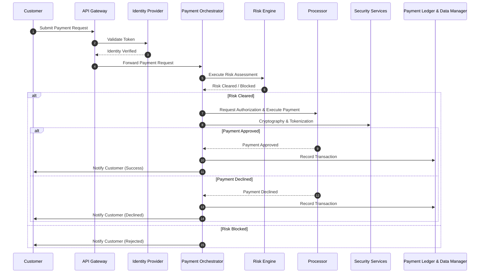

# 5 Runtime View

<!-- TOC -->

- [5 Runtime View](#5-runtime-view)
    - [5.1 Scenario 1 - Payment (Simplified)](#51-scenario-1---payment-simplified)
- [Solution Content](#solution-content)

<!-- /TOC -->

The runtime view describes concrete behavior and interactions of the system’s building blocks in form of scenarios in order to show that the use cases are covered by the runtime of the application, for the case of this project we will just represent a single simplified workflow.

## 5.1 Scenario 1 - Payment (Simplified)

| Actor      | Description                                               |
|------------|-----------------------------------------------------------|
| Customer   | Initiates the payment through the platform                |
| Payment Processor | External system that processes the payment               |

| Participant          | Description                                                                 |
|----------------------|-----------------------------------------------------------------------------|
| Payment API Gateway         | Entry point for external API requests and initial validation                |
| Payment Orchestrator | Coordinates the full payment lifecycle (risk check, processing, settlement) |
| Risk Assessment Engine         | Assesses fraud risk and transaction trust level                             |
| Payment Ledger & Data Manager       | Stores the transaction state and result                                     |
| Identity Provider | Authenticates and verifies the identity of the user |

Workflow: 

> [!NOTE] 
> Please remember that this is a simplified version

1. **Customer** initiates a payment request through the **Payment API Gateway**.
2. The API Gateway forwards the request to the **Identity Provider** to validate the customer's token and identity.
3. Once the identity is confirmed, the API Gateway sends the request to the **Payment Orchestrator**.
4. The **Payment Orchestrator** begins the payment flow by calling the **Risk Engine** to perform fraud and risk assessment.
5. The **Risk Engine** evaluates the transaction using rule-based and ML-based models and returns a result (cleared or blocked).
6. If the transaction is cleared:
   - The Payment Orchestrator request encryption and sends the request to the **Payment Processor** to authorize and execute the payment.
   - **Customer** is notified of the payment status.
7. If the transaction is blocked:
   - The Payment Orchestrator notifies the **Customer** that the payment was rejected due to Risk Clearance issues.
8. In any case, the **Payment Orchestrator** records the transaction in the **Payment Ledger**.

<!-- CONTENTTABLE:START -->
# Solution Content

1. [Introduction and Goals](01-introduction-and-goals.md)
2. [Technical Constraints](02-technical-constraints.md)
3. [System Context and Scope](03-system-context-and-scope.md)
4. [Building Block View](04-building-block-view.md)
5. [Runtime Overview](05-RuntimeOverview.md)
6. [Design Decisions](06-design-decisions.md)
7. [Technical Risks](07-technical-risks.md)
8. [Quality Requirements](08-quality.md)
9. [Glossary](09-glossary.md)
<!-- CONTENTTABLE:END -->