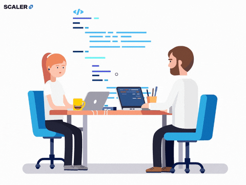

# 8 Quality Requirements

	<code></code>

<!-- TOC -->

- [8 Quality Requirements](#8-quality-requirements)
- [Solution Content](#solution-content)

<!-- /TOC -->

| ID      | Quality                | Fulfillment Justification |
|:---:|:---:|:---:|
| QG-001  | Security               | The system integrates AWS-native security services (e.g., KMS, Secrets Manager, Network Firewall, Payment Cryptography, GuardDuty) and follows best practices (encryption, multi-account setup, TLS, mTLS, token validation) to ensure compliance with GDPR, PSD2, and AML regulations. |
| QG-002  | Security               | End-to-end encryption is enforced through KMS and ACM. IAM roles and Cognito with multi-factor authentication ensure least privilege and Zero Trust access. Each subsystem applies its own authentication and authorization checks, isolating services appropriately. |
| QG-003  | Compatibility          | The use of standardized Open Banking APIs, dedicated Open Banking Services, and Data Exchange modules ensures smooth integration with financial institutions. VPNs, Route53, and NAT Gateways facilitate secure connectivity. |
| QG-004  | Compatibility          | The 3rd Party Gateway and API abstraction layers enable integration with external PSPs via REST APIs, Webhooks, or encrypted channels. Network segmentation and validation layers ensure secure and flexible interactions. |
| QG-005  | Maintainability        | The architecture includes centralized alerting, logging, and monitoring through AWS CloudWatch, Kinesis, SNS, SES, and integration with Datadog. The Support Advisor further enhances observability and operational response. |
| QG-006  | Transferability        | Jenkins integration and CI/CD pipelines are defined in the Administration Hub, using infrastructure-as-code (IaC) tools like AWS CloudFormation. The solution supports portability across Jenkins instances and CI/CD environments. |
| QG-007  | Performance Efficiency | Horizontal scaling is enabled through Fargate-based container orchestration, multiregion setup (e.g., DynamoDB Global Tables, Aurora Global), and asynchronous/event-driven architecture using SQS, Kafka (MSK), and Step Functions. |
| QG-008  | Performance Efficiency | The architecture minimizes latency using real-time processing paths, Kinesis for streaming, ElastiCache for caching, and isolated execution paths (sync vs async). Core flows are designed for high throughput under concurrent load. |
| QG-009  | Reliability            | The platform is deployed across multiple regions, with built-in failover via Route53, SQS, Kafka sync, and regional replicas of stateful services. Cloud-native services ensure automatic failover and load distribution. |
| QG-010  | Reliability            | Key services use retries, circuit breakers, event sourcing, and idempotency to maintain consistency during partial failures. Backup and audit components (e.g., S3 tiered storage, data replication) ensure recovery and traceability. |
| QG-011  | Usability              | Administrators and support agents are provided with intuitive tools such as the Admin Console and Support Advisor (Lex-based conversational support), while developers interact through well-documented APIs and self-service tools. |

<!-- CONTENTTABLE:START -->
# Solution Content

1. [Introduction and Goals](01-introduction-and-goals.md)
2. [Technical Constraints](02-technical-constraints.md)
3. [System Context and Scope](03-system-context-and-scope.md)
4. [Building Block View](04-building-block-view.md)
5. [Runtime Overview](05-RuntimeOverview.md)
6. [Design Decisions](06-design-decisions.md)
7. [Technical Risks](07-technical-risks.md)
8. [Quality Requirements](08-quality.md)
9. [Glossary](09-glossary.md)
<!-- CONTENTTABLE:END -->