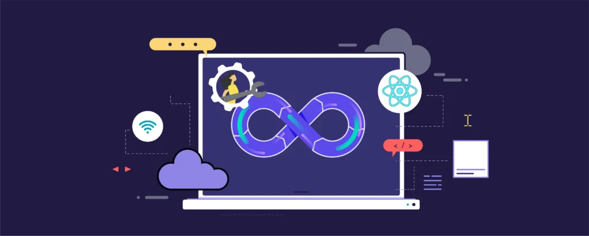

  

<h3 align="center">High-volume Payment Processing Application</h3>

	<code></code>

# Table of Contents

<!-- TOC -->

- [Table of Contents](#table-of-contents)
- [Executive Summary](#executive-summary)
    - [Architecture Overview](#architecture-overview)
    - [Design Principles](#design-principles)
    - [Highlights](#highlights)
    - [Strategic Thinking](#strategic-thinking)
    - [A Personal Note](#a-personal-note)
    - [Background](#background)
    - [Objectives](#objectives)
- [Solution Strategy](#solution-strategy)
- [Solution Content](#solution-content)

<!-- /TOC -->

# Executive Summary

This document presents the **High-Volume Payment Processing Platform**, a modern, scalable, and secure architecture designed to support complex financial transactions with high performance, compliance, and resilience. It is built with a **microservices-oriented**, **API-first**, and **event-driven** approach, leveraging the full capabilities of **Amazon Web Services (AWS)** and integrating seamlessly with external systems such as **payment processors**, **financial institutions**, **business intelligence tools** and **advanced monitoring solutions**.

## Architecture Overview

The solution has been broken down into clearly defined building blocks, as illustrated in the **System Context** and **Container Views**, providing both high-level vision and deep insight into functional decomposition. Each subsystem (or “hub”) is responsible for a well-scoped set of responsibilities, promoting separation of concerns and ease of maintenance. In all the sections you may found what has been assumed and what has been designed, including the **C4 model** and **Arc42** principles.

- **Payment Hub**: The heart of the platform — handling validations, orchestrations, risk assessments, and settlement logic.
- **Integration Hub**: Bridges the platform to financial institutions and third-party gateways, including full Open Banking capabilities.
- **Reporting Hub**: Enables real-time and batch reporting, with anonymized data, ETL pipelines, and support for external BI tools.
  - **Analytics Engine**: Transforms anonymized payment data via Glue/EMR and surfaces business insights using QuickSight and OpenSearch.
- **Monitoring & Alerting**: Centralized logging and alert management using CloudWatch and SNS/SES, enhanced with **Datadog** for observability.
  - **Support Advisor**: A smart assistant that helps agents resolve alerts with contextual data, AI-powered insights (SageMaker, Bedrock), and external knowledge lookup (Kendra).
- **Administration Hub**: Supports platform configuration and cloud resource management using AWS-native services like Control Tower and SSM.
- **Security Hub**: Ensures compliance with security standards through centralized identity, cryptographic, and threat detection services.
  - **Identity Provider**: Authenticates all actors using AWS Cognito and IAM, supporting SSO, OAuth2, and federated identity integrations.

## Design Principles

The architecture was built on the following core design pillars:

- **Security-First**: Implements zero trust principles, strong encryption, strict least privilege IAM, token-based authentication, and modular security enforcement across all hubs.
- **Modular and Scalable**: Each component is independently deployable and can scale horizontally, supporting growth and traffic surges.
- **Resilience & Observability**: Built-in alerting, structured logging, health checks, and recovery mechanisms ensure system robustness.
- **Open & Compliant**: Complies with industry regulations (GDPR, PSD2, AML), supports external integrations, and provides secure data exchange mechanisms.
- **Cloud Native**: Fully AWS-native, using the right services for the right job — combining ECS/Fargate, S3, DynamoDB, Aurora, Kinesis, and more.
- **Data-Centric**: Provides real-time and batch capabilities for data analytics and operations, all while preserving privacy and supporting re-identification when needed.

## Highlights

- **Multi-Region Architecture**: Key services are deployed in multiple AWS regions with DNS-based routing (Route 53), ensuring low latency and failover.
- **Event-Driven Workflows**: Decoupled components communicate via Kinesis, SQS, and EventBridge, supporting async and reactive workflows.
- **Microservices**: Each complex component derivate in a sum of microservices when a native solution can't provide the solution, allowing for independent development, deployment, and scaling.
- **Smart Support**: The Support Advisor empowers human agents with contextual, AI-assisted diagnostics powered by LangChain, SageMaker, and Amazon Bedrock.
- **Self-Service Configuration**: Admin Console allows fine-grained control over the system via low-touch, secure interfaces using bastion hosts and configuration platforms.
- **Professional Observability**: Datadog was selected as the observability platform for its seamless AWS integration and excellent cost-to-value ratio, supporting metrics, traces, and logs from all hubs.

## Strategic Thinking

The architectural choices aim to balance innovation with best practices. For example:

- Instead of reinventing the wheel, AWS-native services are used to maximize efficiency.
- Modularity and strict boundaries between domains reduce blast radius and foster independent evolution.
- Decision logs are kept transparent and include tradeoffs (e.g., why **Datadog** over AppDynamics or Instana).

## A Personal Note

This solution wasn’t just about designing something that might work in real life — it was about building something elegant, scalable, and practical for a real-world scenario. I've combined my experience designing systems at scale with careful attention to details such as:

- regulatory compliance,
- operational resilience,
- developer ergonomics, and
- business agility.

## Background

This document aim to describe the architecture and design of a new high-volume payment processing platform that handle hundreds of thousands of transactions per daily. 

The goal is to design a scalable, secure, and highly available system that ensures seamless and reliable payment processing.

> [!WARNING] 
> **AI Usage** : Some of the content of this documentation has been redacted by AI and reviewed later by the author for optimizing or styling purposes. Tools used include OpenAI and GH Copilot.

> [!WARNING] 
> **Raw Data** : All the images can be checked in the `assets` folder. Also all the pages served are docummented as markdown files inside the repository.

## Objectives

The main objectives of this platform are:

**Scalability**: The platform should be able to scale horizontally to handle increasing transaction volumes.
**Security**: Implement robust security measures to protect sensitive financial data and ensure compliance with industry regulations (e.g., PCI DSS).
**High Availability**: Ensure the platform is highly available with minimal downtime.
**Performance**: Optimize for low latency and high throughput to provide a smooth user experience.
**Fault Tolerance**: Ensure the system can recover quickly from failures and maintain data consistency.
**Regulatory Compliance**: Ensure the platform meets all relevant regulatory and compliance requirements.
**Monitoring**: Implement comprehensive monitoring and logging to track performance and detect issues.

#  Solution Strategy
  

The architecture of the High-Volume Payment Processing Platform (HVP3) is designed to support a modern, scalable, and resilient payment infrastructure tailored for a Fintech environment. It adheres to the **Arc42** and **C4 model** principles, combining clear structural organization with visual architectural representations to ensure transparency and maintainability.

The chosen approach is based on the following strategic pillars:

- **Event-Driven Architecture**: The system heavily relies on asynchronous event handling using services such as Amazon SQS, Kafka, and AWS Lambda to decouple components and enable scalable real-time processing.
- **Microservices-Based Design**: Each major function (e.g., Payment Orchestrator, Risk Assessment Engine, Open Banking Services) is implemented as an independently deployable service, enabling continuous delivery, isolated fault domains, and modular evolution of the platform.
- **API-Centric Interaction**: All external and internal communications are API-first. Public-facing APIs are exposed through secured API Gateways using OAuth2 and mTLS, supporting seamless integration with customers, merchants, and financial institutions.
- **Cloud-Native Deployment**: AWS is used as the primary cloud provider, leveraging services such as ECS Fargate, API Gateway, Redshift, Lambda, and Bedrock to achieve elasticity, observability, and managed operations at scale.
- **Security by Design**: Core security mechanisms (IAM, KMS, Cognito, Network Firewall, GuardDuty, and Secrets Manager) are embedded across all layers to ensure end-to-end encryption, least privilege access, and regulatory compliance (e.g., PCI DSS, GDPR).
- **Multiregion Architecture**: All critical components are replicated across regions to ensure high availability, fault tolerance, and disaster recovery. Internal Route 53 zones, NAT Gateways, and cross-region Kafka syncs are used to support this strategy.
- **Monitoring and Observability**: The solution integrates AWS-native tools (CloudWatch, CloudTrail, SNS) with external platforms like **Datadog** to provide deep observability, alerting, and operational intelligence across accounts and regions.
- **Analytics and Reporting**: Anonymized data is stored in S3 and processed using Glue and EMR, queried via Athena, and served through Redshift, OpenSearch, and QuickSight. AWS Data Exchange allows external sharing with other BI tools.
- **Support and Automation**: An intelligent support assistant powered by Amazon Lex, Kendra, SageMaker, and Bedrock guides support agents through incidents using historical data, documentation, and generative AI.

This solution strategy provides a solid foundation for building a secure, high-performance, scalable financial transaction platform that can adapt to growth and regulatory evolution.

<!-- CONTENTTABLE:START -->
# Solution Content

1. [Introduction and Goals](01-introduction-and-goals.md)
2. [Technical Constraints](02-technical-constraints.md)
3. [System Context and Scope](03-system-context-and-scope.md)
4. [Building Block View](04-building-block-view.md)
5. [Runtime Overview](05-RuntimeOverview.md)
6. [Design Decisions](06-design-decisions.md)
7. [Technical Risks](07-technical-risks.md)
8. [Quality Requirements](08-quality.md)
9. [Glossary](09-glossary.md)
<!-- CONTENTTABLE:END -->